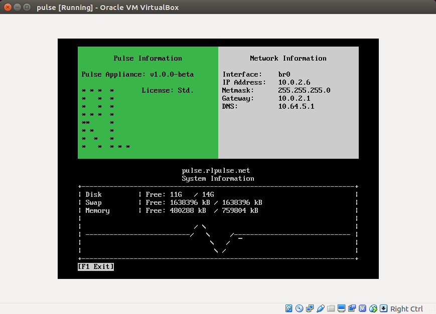

# Linux Server Login TUI 
Contributors: Sai Nimmagadda

## Project Description
For use at RL Solutions only. Basic login TUI for future appliance  built in C using Ncurses. 

## File Structure
- pulseTUI.png
- tui.pp: puppet manifest. Execute via Puppet to implement on appliance
- src: files to run TUI
- bin: executables

